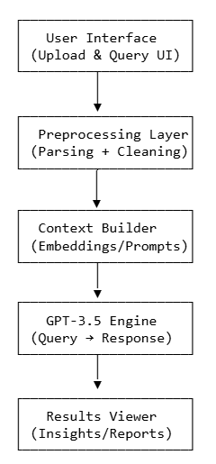

# GenAI-Enabled Financial Analysis Platform  

##  Overview  
The **GenAI-Enabled Financial Analysis Platform** is an application designed to automate the analysis of financial documents across industries.  
By leveraging **Generative AI (GPT-3.5)** with **prompt engineering**, the system extracts relevant insights from unstructured data, enabling users to query specific financial information without manually reading lengthy reports.  

---

## Key Features  
-  **Multi-Document Processing** – Handles diverse document formats (PDF, DOCX, TXT).  
-  **Generative AI Integration** – GPT-3.5 extracts context-aware insights from financial data.  
-  **Intelligent Query Engine** – Users ask natural language questions; platform delivers precise answers.  
-  **Prompt Engineering** – Optimized prompts for higher accuracy and reduced hallucinations.  
-  **User-Friendly Interface** – Clean, intuitive design suitable for analysts and executives.  

---

##  Technical Architecture  

###  Tech Stack  
- **Frontend**: React + TailwindCSS (query input, results visualization)  
- **Backend**: Python (FastAPI/Flask REST APIs)  
- **LLM Integration**: OpenAI GPT-3.5 API  
- **Data Handling**: Pandas, PyPDF2, LangChain (for document parsing and context building)  
- **Database**: PostgreSQL / SQLite (optional for storing queries & metadata)  
- **Deployment**: Docker + Cloud (AWS/GCP/Azure)  

###  Workflow  
1. **Upload Documents** → Financial documents uploaded in bulk.  
2. **Preprocessing Layer** → Documents parsed, cleaned, and structured (PDF → text).  
3. **Embedding & Context Builder** → Key sections extracted and passed into the prompt pipeline.  
4. **Generative AI Engine** → GPT-3.5 answers queries using context + optimized prompts.  
5. **Response Delivery** → Insights visualized in an intuitive UI.  

    

---

##  Example Use Cases  
- Extracting **key metrics** from quarterly earnings reports.  
- Summarizing **financial risk factors** in regulatory filings.  
- Comparing performance across **multiple industries**.  
- Quickly answering ad-hoc queries (e.g., *“What is the debt-to-equity ratio for Company X in Q2?”*).  

---

##  Business Impact  
-  **Faster Insights** – Reduced manual document review time by over 70%.  
-  **Improved Accuracy** – Optimized prompts ensure relevant, context-driven answers.  
-  **Enterprise Value** – Demonstrated the synergy of **Generative AI + Finance** for analysts, investors, and decision-makers.  
-  **Scalability** – Platform designed to scale across industries and document types.  

---